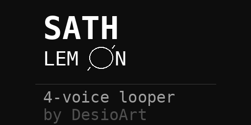

# SATH LEMON 🍋

**performance looper with 4 independent voices and dynamic loop control.**

*sath lemon is a live performance looper designed for spontaneous composition and layering. each of the four voices can record up to 15 seconds of audio, with intelligent loop length management that adapts to your recording duration — no unwanted silence at the end of your loops.*

*the script features extensive grid/launchpad integration with visual feedback, making it perfect for hands-on live performance.*

---


## Splash screen



## Requirements

- norns
- audio input
- grid (optional, highly recommended)

---

## Installation

**via maiden:**
```
;install https://github.com/DesioArt/sath-lemon
```

**manual installation:**
- connect to norns via SFTP (we/sleep)
- navigate to `/home/we/dust/code/`
- create folder `Sath_lemon`
- upload `Sath_lemon.lua` into that folder
- restart norns or SYSTEM > RESTART

---

## Documentation

### Norns Controls

**Key controls:**
- `K1` — switch page (LOOP ↔ PITCH)
- `K2` — start/stop recording on selected voice
- `K3` — play/stop selected voice

**Page 1 — LOOP:**
- `E1` — select voice (1–4)
- `E2` — loop length (0.1s to recorded length)
- `E3` — start position (where in the sample the loop begins)

**Page 2 — PITCH:**
- `E1` — pitch/speed (0.25x to 4x, with smooth glide)
- `E2` — level (0 to 2)
- `E3` — pan (−1 to 1)

---

### Recording Workflow

1. select a voice (E1 or grid)
2. press K2 to start recording (max 15 seconds)
3. press K2 again to stop — the loop automatically starts playing
4. the loop length is set to your actual recording duration (no silence added)
5. tweak loop parameters in real-time while playing

**Intelligent loop length:**
- if you record 7 seconds and stop, `loop_length = 7s`
- you can reduce it (E2) to 2s, 3s, etc.
- E2 will never go beyond your recorded length (no unwanted silence)
- if you record the full 15 seconds, you get the full range

---

### Grid Layout

the grid provides visual feedback and tactile control over all loop functions. each row represents a voice, with real-time visualization of loop position and length.

**Rows 1–4: loop visualization**
- each row shows one voice
- 16 columns = recorded sample length
- lit LEDs = active loop region
- LED brightness indicates voice state:
  - `bright (15)` = playing or selected voice
  - `medium (8)` = has sample, not playing
  - `dim (2)` = no sample
  - `outline (1)` = selected voice, outside loop area

**Row 5: voice selection**
- columns 1–4: select voice 1–4
- bright LED = selected voice

**Row 6: playback & effects**
- columns 1–4: play/stop individual voices
  - bright = playing
  - medium = ready (has sample)
  - dim = no sample
- column 8: play all / stop all toggle
  - bright = something playing (press to stop all)
  - medium = nothing playing (press to play all with samples)
- columns 9–12: reverse toggle for voices 1–4
  - bright = reversed
  - dim = normal
- columns 13–16: speed presets for selected voice
  - col 13: `0.5x` (half speed)
  - col 14: `1.0x` (normal)
  - col 15: `1.5x`
  - col 16: `2.0x` (double speed)
  - bright LED = current speed

**Row 7: mute controls**
- columns 1–4: mute/unmute voices 1–4
  - bright = muted (loop still running, just silent)
  - dim = unmuted

**Row 8: progress indicator**
- during recording: shows recording progress (0–15 seconds)
- during playback: shows all active loops with different brightnesses per voice

---

## Features

**Smooth pitch glide**
- pitch changes are gradual instead of abrupt
- creates smooth, musical transitions
- works with encoder and grid speed presets

**Reverse playback**
- per-voice reverse control
- works in combination with any speed setting
- can be toggled in real-time

**Intelligent recording**
- loops adapt to actual recording duration
- no unwanted silence at loop end
- maximum flexibility for live performance

**Visual feedback**
- grid shows exact loop position and length
- real-time updates as you adjust parameters
- intuitive visual representation of all voices

---

## Tips & Tricks

**Quick layering:**
use "play all" (row 6, column 8) to start all voices simultaneously — great for building dense textures.

**Rhythmic variations:**
record one phrase, then use loop length (E2) to create variations. different loop lengths create polyrhythmic patterns.

**Creative reverse:**
reverse + slow speed (0.5x) = ambient, backwards atmospheres.
reverse + fast speed (2.0x) = glitchy, chaotic textures.

**Live chopping:**
record long phrases (15s), then use start position (E3) and loop length (E2) to "scrub" through different sections — perfect for finding unexpected moments.

**Performance workflow:**
use grid for hands-on performance, adjust fine parameters with norns encoders, switch between LOOP and PITCH pages for different control needs.

---

## Credits

created by [DesioArt](https://github.com/DesioArt)
built for [monome norns](https://monome.org/norns)

---

## License

MIT
