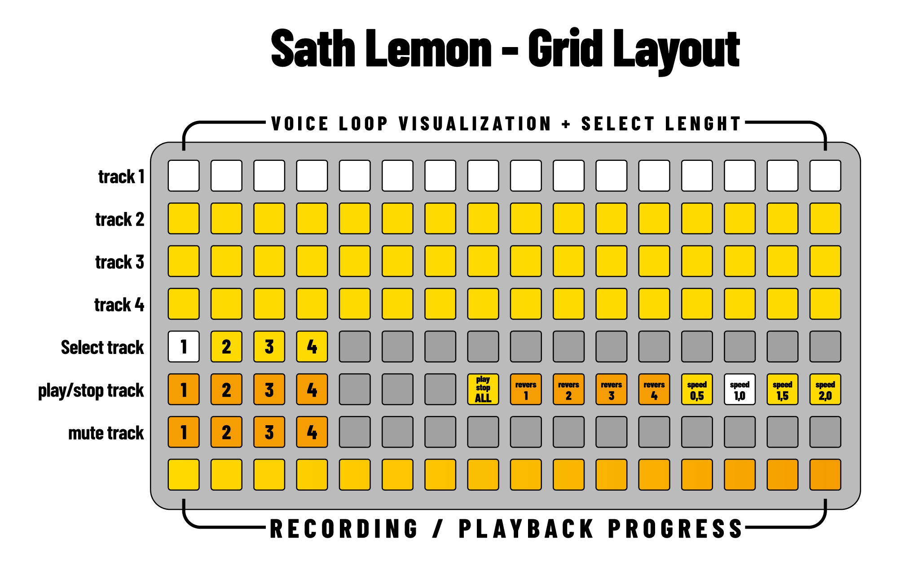

# SATH LEMON 🍋

**performance looper with 4 independent voices and dynamic loop control.**

*sath lemon is a live performance looper designed for spontaneous composition and layering. each of the four voices can record up to 15 seconds of audio, with intelligent loop length management that adapts to your recording duration — no unwanted silence at the end of your loops.*

*the script features extensive grid/launchpad integration with visual feedback, making it perfect for hands-on live performance.*

---

## Splash screen


## Requirements

- norns
- audio input
- grid (optional, highly recommended)

---

## Versions

**`Sath_lemon.lua`** — standard version, compatible with any grid via midigrid.

---

## Installation

**via maiden:**
```
;install https://github.com/DesioArt/sath-lemon
```

**manual installation:**
- connect to norns via SFTP (we/sleep)
- navigate to `/home/we/dust/code/`
- create folder `Sath_lemon`
- upload `Sath_lemon.lua` into that folder
- restart norns or SYSTEM > RESTART

---

## Documentation

### Norns Controls

**Key controls:**
- `K1` — switch page (LOOP ↔ PITCH)
- `K2` — start/stop recording on selected voice
- `K3` — play/stop selected voice

**Page 1 — LOOP:**
- `E1` — select voice (1–4)
- `E2` — loop length (0.1s to recorded length)
- `E3` — start position (where in the sample the loop begins)

**Page 2 — PITCH:**
- `E1` — pitch/speed (0.25x to 4x, with smooth glide)
- `E2` — level (0 to 2)
- `E3` — pan (−1 to 1)

---

### Recording Workflow

1. select a voice (E1 or grid)
2. press K2 to start recording (max 15 seconds)
3. press K2 again to stop — the loop automatically starts playing
4. the loop length is set to your actual recording duration (no silence added)
5. tweak loop parameters in real-time while playing

**Intelligent loop length:**
- if you record 7 seconds and stop, `loop_length = 7s`
- you can reduce it (E2) to 2s, 3s, etc.
- E2 will never go beyond your recorded length (no unwanted silence)
- if you record the full 15 seconds, you get the full range

---

### Grid Layout


the grid provides visual feedback and tactile control over all loop functions. each row represents a voice, with real-time visualization of loop position and length.

**Rows 1–4: loop visualization & loop selection**
- each row shows one voice
- 16 columns = recorded sample length
- lit LEDs = active loop region
- **single tap** on a row = select that voice
- **hold one pad + tap another pad on the same row** = set loop start and end points visually
- **hold row 8 pad 16 (function button) + tap any pad on rows 1–4** = set minimum loop length at that position

**Row 5: voice selection**
- columns 1–4: select voice 1–4

**Row 6: playback & effects**
- columns 1–4: play/stop individual voices
- column 8: play all / stop all toggle
- columns 9–12: reverse toggle for voices 1–4
- columns 13–16: speed presets for selected voice
  - col 13: `0.5x` (half speed)
  - col 14: `1.0x` (normal)
  - col 15: `1.5x`
  - col 16: `2.0x` (double speed)

**Row 7: mute controls**
- columns 1–4: mute/unmute voices 1–4

**Row 8: progress indicator + function button**
- during recording: shows recording progress (0–15 seconds)
- during playback: shows all active loops with different brightnesses per voice
- **pad 16**: function button — hold to enable minimum loop selection on rows 1–4

---

### Loop Selection via Grid

sath lemon supports direct loop selection by interacting with the voice rows on the grid:

**Select a loop portion (two-pad gesture):**
- hold a pad on a voice row (rows 1–4) to set the start point
- while holding, press a second pad on the same row to set the end point
- the loop instantly snaps to the selected portion
- encoders E2 and E3 remain available for fine-tuning

**Set minimum loop length (function button):**
- hold the function button (row 8, column 16)
- tap any pad on a voice row
- the loop is set to the minimum size (~0.94s) at that position
- useful for granular-style micro-loops

---

## Features

**Smooth pitch glide**
- pitch changes are gradual instead of abrupt
- creates smooth, musical transitions
- works with encoder and grid speed presets

**Reverse playback**
- per-voice reverse control
- works in combination with any speed setting
- can be toggled in real-time

**Intelligent recording**
- loops adapt to actual recording duration
- no unwanted silence at loop end
- maximum flexibility for live performance

**Visual feedback**
- grid shows exact loop position and length
- real-time updates as you adjust parameters
- intuitive visual representation of all voices

**Loop selection via grid**
- hold two pads on a voice row to instantly select a loop portion
- function button (row 8, pad 16) + tap for minimum loop size
- combine with encoders for precise control

**Loop selection via grid**
- select loop start and end points directly on the grid by holding two pads
- use the function button (row 8, pad 16) for minimum loop selection
- encoders remain available for fine-tuning

---

## MK3 RGB Setup

`Sath_lemon_mk3.lua` uses full RGB colors on the Launchpad Mini MK3. to enable this, you need to modify the `brightness_map` in midigrid.

**backup first:**
```lua
os.execute("cp /home/we/dust/code/midigrid/lib/devices/launchpad_rgb.lua /home/we/dust/code/midigrid/lib/devices/launchpad_rgb.lua.bak")
```

**then apply the new brightness_map from maiden:**
```lua
local f = io.open("/home/we/dust/code/midigrid/lib/devices/launchpad_rgb.lua", "w")
f:write('local launchpad = include(\'midigrid/lib/devices/generic_device\')\nlaunchpad.grid_notes= {\n  {81,82,83,84,85,86,87,88},\n  {71,72,73,74,75,76,77,78},\n  {61,62,63,64,65,66,67,68},\n  {51,52,53,54,55,56,57,58},\n  {41,42,43,44,45,46,47,48},\n  {31,32,33,34,35,36,37,38},\n  {21,22,23,24,25,26,27,28},\n  {11,12,13,14,15,16,17,18}\n}\nlaunchpad.brightness_map = {\n  0, 1, 2, 3, 21, 49, 37, 45,\n  13, 9, 38, 9, 5, 13, 12, 119\n}\nreturn launchpad\n')
f:close()
print("done")
```

**to restore the original:**
```lua
os.execute("cp /home/we/dust/code/midigrid/lib/devices/launchpad_rgb.lua.bak /home/we/dust/code/midigrid/lib/devices/launchpad_rgb.lua")
```

**note:** this modification affects all scripts that use midigrid with the Launchpad Mini MK3. other scripts will still work correctly but will use the new color mapping.

### MK3 Color Legend

| color | state |
|-------|-------|
| white | selected voice / inactive button |
| green | playing |
| red | stopped with sample / recording |
| blue | selected voice (row 5) / muted |
| cyan | reverse active / play all available |
| purple | stop all active / speed preset |
| orange | 2x speed preset |
| yellow | has sample, stopped |

---

## Tips & Tricks

**Quick layering:**
use "play all" (row 6, column 8) to start all voices simultaneously — great for building dense textures.

**Rhythmic variations:**
record one phrase, then use loop length (E2) to create variations. different loop lengths create polyrhythmic patterns.

**Creative reverse:**
reverse + slow speed (0.5x) = ambient, backwards atmospheres.
reverse + fast speed (2.0x) = glitchy, chaotic textures.

**Live chopping:**
record long phrases (15s), then hold two pads on the voice row to instantly select a loop region — perfect for finding unexpected moments in real time.

**Performance workflow:**
use grid for hands-on performance, adjust fine parameters with norns encoders, switch between LOOP and PITCH pages for different control needs.

---

## Credits

created by [DesioArt](https://github.com/DesioArt)
built for [monome norns](https://monome.org/norns)

---

## License

MIT
